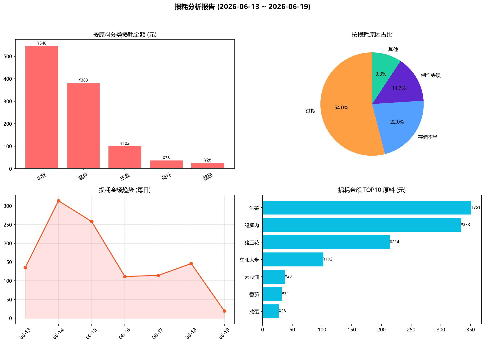
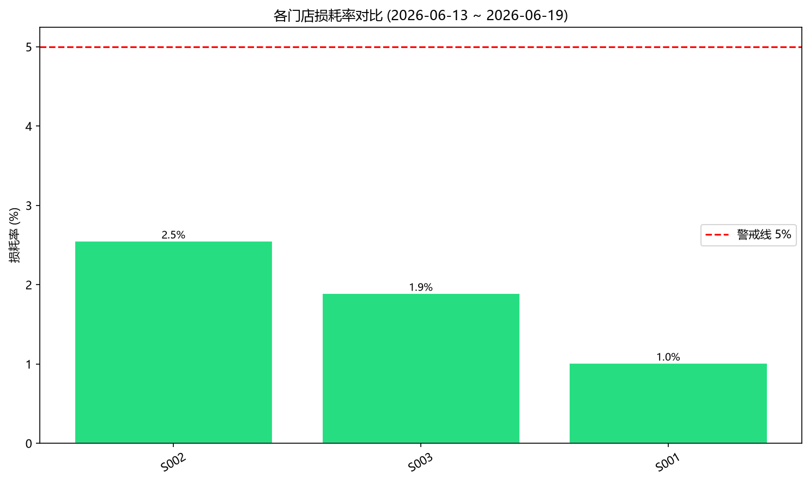

# 餐饮后厨损耗分析报告

> 统计周期：**2026-06-13 ~ 2026-06-19**  （共 7 天）

> 生成时间：2026-06-19 01:15:27

## 一、关键指标

| 指标 | 数值 |
|------|------|
| 损耗总金额 | ¥ 1,097.95 |
| 损耗总数量 | 105.100 |
| 损耗记录数 | 15 条 |
| 出库总金额 | ¥ 81,797.54 |
| **综合损耗率** | **1.34%** |

## 二、损耗金额 TOP10 原料

| 排名 | 原料名称 | 分类 | 损耗量 | 损耗金额 | 占比 |
|------|----------|------|--------|----------|------|
| 1 | 生菜 | 蔬菜 | 63.800 kg | ¥ 350.90 | 32.0% |
| 2 | 鸡胸肉 | 肉类 | 11.700 kg | ¥ 333.45 | 30.4% |
| 3 | 猪五花 | 肉类 | 5.100 kg | ¥ 214.20 | 19.5% |
| 4 | 东北大米 | 主食 | 15.000 kg | ¥ 102.00 | 9.3% |
| 5 | 大豆油 | 调料 | 2.500 L | ¥ 37.50 | 3.4% |
| 6 | 番茄 | 蔬菜 | 4.500 kg | ¥ 32.40 | 3.0% |
| 7 | 鸡蛋 | 蛋品 | 2.500 kg | ¥ 27.50 | 2.5% |

## 三、按分类维度聚合

| 分类 | 损耗金额 | 占比 | 损耗次数 |
|------|----------|------|----------|
| 肉类 | ¥ 547.65 | 49.9% | 3 |
| 蔬菜 | ¥ 383.30 | 34.9% | 9 |
| 主食 | ¥ 102.00 | 9.3% | 1 |
| 调料 | ¥ 37.50 | 3.4% | 1 |
| 蛋品 | ¥ 27.50 | 2.5% | 1 |

## 四、按损耗原因维度聚合

| 原因 | 损耗金额 | 占比 | 次数 |
|------|----------|------|------|
| 过期 | ¥ 593.15 | 54.0% | 9 |
| 存储不当 | ¥ 241.70 | 22.0% | 2 |
| 制作失误 | ¥ 161.10 | 14.7% | 3 |
| 其他 | ¥ 102.00 | 9.3% | 1 |

## 五、门店维度对比

| 门店 | 损耗金额 | 出库金额 | 损耗率 | 状态 |
|------|----------|----------|--------|------|
| S002 | ¥ 223.85 | ¥ 8,764.34 | 2.55% | ✅ 正常 |
| S003 | ¥ 296.40 | ¥ 15,677.14 | 1.89% | ✅ 正常 |
| S001 | ¥ 577.70 | ¥ 57,356.06 | 1.01% | ✅ 正常 |

## 六、月度趋势

| 月份 | 损耗金额 | 损耗量 | 记录数 |
|------|----------|--------|--------|
| 2026-06 | ¥ 1,097.95 | 105.100 | 15 |

## 七、图表分析

---

📎 **附件**：明细数据 Excel - [test_waste_20260613_20260619_waste_report.xlsx](test_waste_20260613_20260619_waste_report.xlsx)
